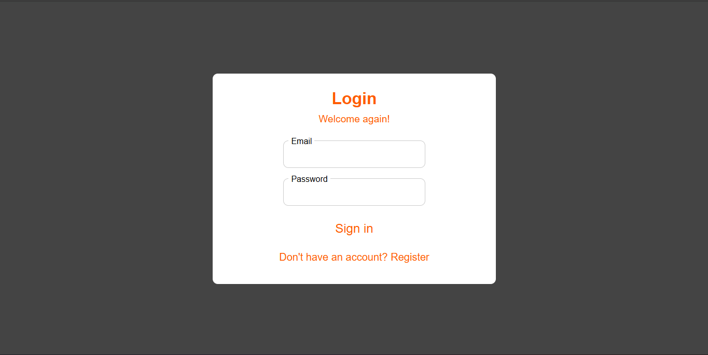
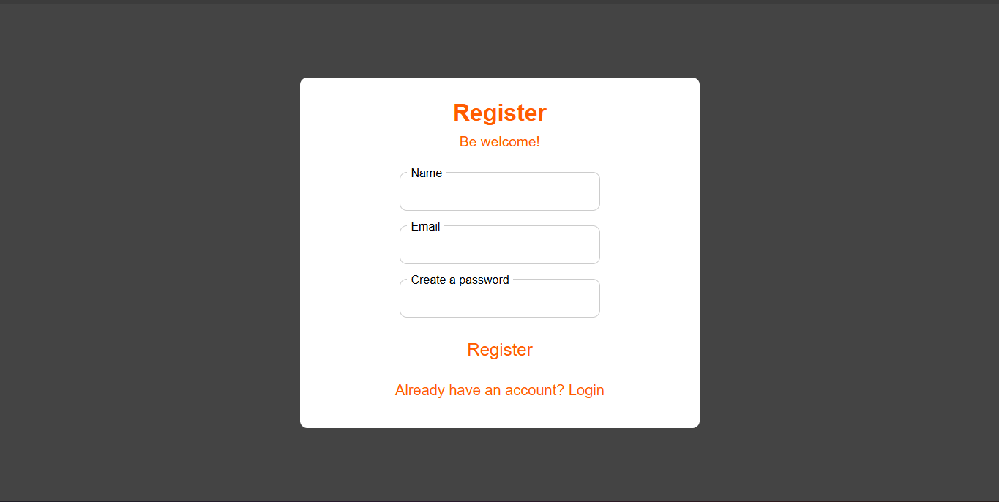
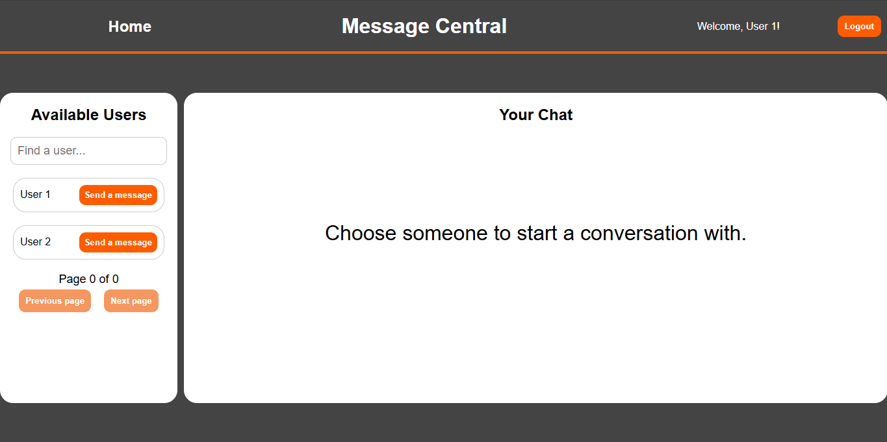
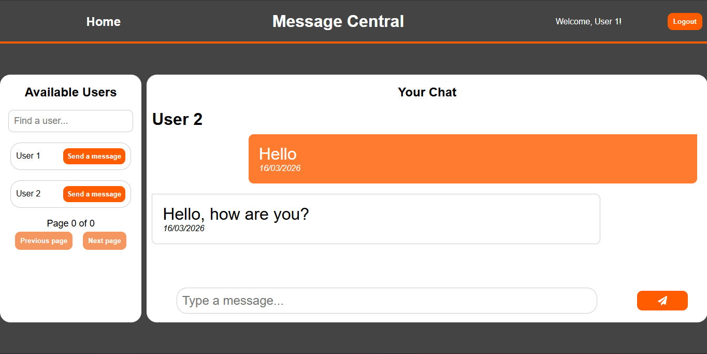

# Message Central Web
Message Central is a real-time chat interface built with React. The application allows users to register, authenticate and exchange messages in real time using WebSocket communication with the backend.
This project is the frontend of the Message Central system.

# Technologies


# Features
- User authentication (JWT)
- Login and registration pages
- User search
- Pagination user list
- Real time chat

# Screenshots

## Login page


## Register Page


## Home Page


## Chat Page (Simulation)


## Authentication

Authentication is handled using JWT (JSON Web Token).

After a successful login, the backend returns a token that is stored in 
`sessionStorage` on the client side. All authenticated requests send 
the token in the `Authorization` header using the Bearer scheme.

Example:

Authorization: Bearer <token>

In the current version, the token is stored in `sessionStorage` to simplify the
authentication flow during development and focus on backend architecture.

## Security Considerations ⚠️

Storing JWTs in `sessionStorage` makes them accessible to JavaScript and therefore
vulnerable to XSS attacks.

In a production-grade environment, the recommended approach would be:

- Use `HttpOnly` and `Secure` cookies to store the access token
- Implement short-lived access tokens
- Use refresh tokens for session renewal
- Apply proper XSS and CSRF protection strategies

This project prioritizes clarity of the authentication flow while acknowledging
production security best practices.

# How to run the project

## Requirements
- Node.js 18+
- npm

## Installation
1. Clone repository:
````
https://github.com/xThgSilva/message-central-web.git
````

3. Enter in your directory

2. Install dependencies using:
````
npm install
````

3. Run the project
````
npm run dev
````

## Dependencies Used
- React
- Vite
- React Router DOM
- SockJS
- STOMP.js


# Future Features
- Responsive layout for most devices
- Better UI style

> If you have any questions, consult the person in charge of the project.